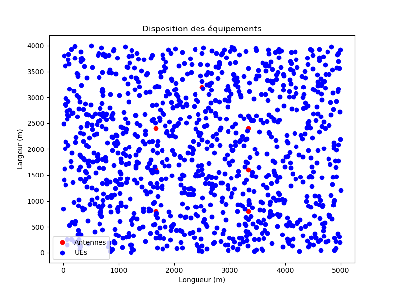
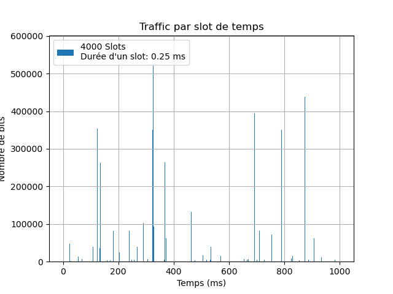
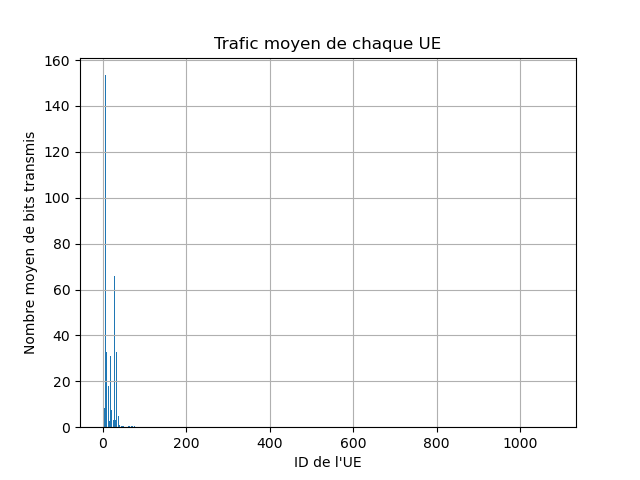
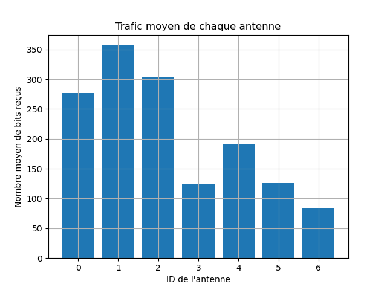
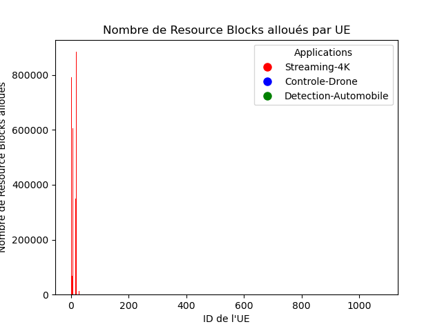

# ELE8702-H24-Projet
Project of ELE8702 class 

## Quick Start Instructions

To quickly get started with the project, follow these steps:

1. **Geometry Description**: 
   Describe your geometry in the `ts_eq79_coords.txt` file. This file should contain the coordinates of your geometry.

2. **Pathloss Computation Configuration**:
   Introduce changes in how the pathloss gets computed through the `ts_eq79_cas.yaml` file. Customize the parameters in this file to adjust the pathloss computation according to your requirements.

3. **Devices Database**:
   Specify your database of all possible devices (antennas and UEs description) with the `devices_db.yaml` file. This file should contain detailed descriptions of antennas and user equipment (UEs) that will be used in your simulations.

4. **Antenna Support and Visibility**:
   - The program only supports one type of antenna at a time.
   - The visibility file (`visibility.txt`) specifies which antennas are in NLOS (Non-Line-of-Sight) situation with the UE. For example, `1 2 3` means UE 1 is in NLOS with Antennas 2 and 3. 
     - The visibility file needs to specify at least 5% and at most 30% of all UEs given in the `ts_eq79_coords.txt` file in NLOS.

5. **Running the Program**:
   To run the program, execute the following command in the terminal:
```
python ts_eq79.py ts_eq79_cas.yaml
```

6. **Graphical Output**:
After running the program, you will find a PDF containing all graphs in `ts_eq79_graphiques.pdf`.


## Dependencies

- **Package:** pdftk

### Installation Instructions:

#### Linux:
To install pdftk on Linux, please use your distribution's package manager:

- **Ubuntu/Debian:**

```
sudo apt install pdftk
```
- **Arch Linux:**
```
sudo pacman -S pdftk
```  

#### Windows:
Please install it by going to [this website](https://www.pdflabs.com/tools/pdftk-the-pdf-toolkit/) and downloading the .exe file. During installation, make sure to select the 'Add application directory to your environmental path' option.

## Plots :












## PDF of combined plots :

- [Lab 3 Graphiques](ts_eq79_graphiques.pdf)